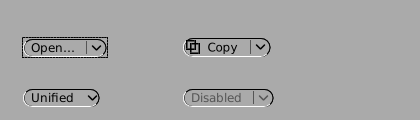
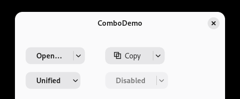

# gnustep-combo-button

Apple's `NSComboButton` (macOS 13) for GNUstep: a button with an attached
menu, implemented once and drawn by each theme. The plan and the spec are in
[#1](https://github.com/danjboyd/gnustep-combo-button/issues/1); decisions are
recorded there and below. The approach follows
[gnustep-window-tabbing](https://github.com/danjboyd/gnustep-window-tabbing).

| GNUstep's theme | Adwaita |
|---|---|
|  |  |

Apps use only Apple's API. On macOS they get AppKit's button; on GNUstep they
get this one, drawn through `GSTheme`. Later the class moves into libs-gui
(`AppKit/NSComboButton.h` and `Source/NSComboButton.m` as they are, the
theme methods into `GSTheme`), and themes keep only their drawing.

## For an app or a theme

Compile the sources in:

```make
GSCOMBOBUTTON_DIR = path/to/gnustep-combo-button
include $(GSCOMBOBUTTON_DIR)/GSComboButton.make
MyApp_OBJC_FILES += $(GSCOMBOBUTTON_OBJC_FILES)
ADDITIONAL_INCLUDE_DIRS += $(GSCOMBOBUTTON_INCLUDE_DIRS)
```

- `GSCOMBOBUTTON_DIR` must be a **relative** path: gnustep-make puts each
  object at `./obj/<target>.obj/<the source's path>`.
- The `+=` lines must come **before** `application.make` (or `bundle.make`,
  `library.make`) is included.

Nothing needs calling: the first time `NSComboButton` is used it adds
GSTheme's default drawing (`GSComboButtonInstall()`), where GSTheme has none.
Compiled against a libs-gui that defines `GS_HAS_COMBO_BUTTON`, this code
declares nothing. If another `NSComboButton` class is loaded first (libs-gui's
own, or another copy of this code), this copy's install does nothing.

```objc
#import "GSComboButton.h"

NSComboButton *open = [NSComboButton comboButtonWithTitle: @"Open…"
                                                     menu: recentMenu
                                                   target: self
                                                   action: @selector(openDocument:)];
```

## The API

As AppKit's:

- `+comboButtonWithTitle:menu:target:action:`,
  `+comboButtonWithImage:menu:target:action:`,
  `+comboButtonWithTitle:image:menu:target:action:`
- `title`, `image`, `imageScaling` (proportionally down by default), `menu`,
  `style`, and `NSControl`'s `target`, `action` and `enabled`
- `NSComboButtonStyleSplit` (the default): a click on the title sends the
  action; a press on the arrow at the right shows the menu.
- `NSComboButtonStyleUnified`: a click sends the action; a press held for
  0.4 s, or dragged 3 points, shows the menu.
- The menu opens below the button, left edges lined up, or above it when
  there's no room below. It is tracked as a context menu is: released over an
  item chooses it; released elsewhere, the menu stays open for a click.
- Before the menu shows, its delegate gets `-menuNeedsUpdate:` once.
- `intrinsicContentSize`, `fittingSize` and `-sizeToFit`: a rounded push
  button's size for the title and image, in the theme's font and margins,
  plus the arrow.
- Like AppKit's, it has no key equivalent. A subclass that wants Return
  overrides `-performKeyEquivalent:`. Space presses the main part.
- NSCoding, keyed and not.

## The theme's methods

GSTheme has a plain default for each, in system colours; a theme overrides
what it draws differently. They are declared in `GSComboButton.h`.

```objc
- (CGFloat) comboButtonArrowWidth: (NSComboButton *)button;          /* 24, unified 18 */
- (void) drawComboButtonBezel: (NSComboButton *)button
                        frame: (NSRect)frame
                         part: (GSComboButtonPart)part
                        state: (GSThemeControlState)state;
- (void) drawComboButtonDivider: (NSComboButton *)button
                          frame: (NSRect)frame
                          state: (GSThemeControlState)state;
- (void) drawComboButtonArrow: (NSComboButton *)button
                        frame: (NSRect)frame
                        state: (GSThemeControlState)state;
```

The button draws its whole bezel (`GSComboButtonWholePart`) in its own state,
then a split button's main or arrow part pressed over it while that part is
pressed or its menu is open; then the title and image, the divider and the
arrow. The default bezel is the theme's own push button bezel
(`-drawButton:in:view:style:state:` with `NSRoundedBezelStyle`), a part being
the whole bezel clipped to the part, so a theme that draws buttons draws combo
buttons that match without overriding anything: the Adwaita picture above has
no Adwaita-specific code.

## GNUstep behaviour this code works around

Each is noted where the code does it, and is worth fixing in libs-gui:

- **`-[NSMenu update]` recursion.** It calls the delegate's `-menuNeedsUpdate:`
  before its own recursion check, and changing an item (`-itemChanged:`, from
  `-setTarget:` and the like) calls `-update`. So a delegate that fills its
  menu in `-menuNeedsUpdate:`, as AppKit intends, recurses until the stack
  overflows. The button detaches the delegate, calls it once itself, and puts
  it back after the menu closes. (Under AppKit, `-menuNeedsUpdate:` runs once
  per showing; this gives the same.)
- **`-popUpMenuPositioningItem:atLocation:inView:` shows nothing** in
  `NSWindows95InterfaceStyle` (a check in `-[NSMenuPanel orderFrontRegardless]`
  hides any top-level menu that isn't a pop-up button's). The button shows its
  menu as `-[GSTheme rightMouseDisplay:forEvent:]` shows a context menu
  (`-displayTransient`, the menu view tracking the press), at a place of its
  own, since a context menu opens at a point and can't keep clear of the
  button.
- **`NSView` has no `-fittingSize`** in GNUstep; the class declares and
  implements its own.

## Tests

```sh
make && DISPLAY=:<a private Xvfb> make check
```

`Tests/gui/NSComboButton` (gnustep-tests) needs a display, and skips without
one: installing the theme's methods, the constructors and defaults, the parts'
geometry and a theme's arrow width, the action (from `-performClick:` and from
a press and release, and none when disabled or released off the button), the
menu's delegate (called once, and put back), where the menu opens, the drawing
reaching the theme, and keyed and non-keyed archiving. The menu's own tracking
is modal and isn't run there; `Examples/ComboDemo` shows it
(`make combodemo`).

CI builds with GCC and with clang against Debian trixie's GNUstep packages,
and runs the tests under Xvfb.

## Not done yet

- Opening the menu from the keyboard (AppKit: the Down arrow, or VoiceOver's
  show menu action). GNUstep's menu tracking needs a press to track from.
- A theme's suggested (accent) look. AppKit's NSComboButton has no default
  button state; ScreenshotTool's Open… is the window's default button under
  Adwaita today (blue, Return). Whether a combo button should be able to be
  the default button cell, and how a theme learns it, is open in #1.
- Accessibility beyond the button role and label.

## Licence

LGPL 2.1 or later, as libs-gui; see `LICENSE`.
